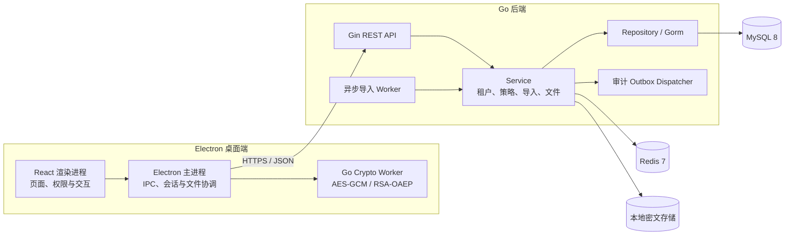

# CP-ABE 加密文件共享系统

面向多租户场景的加密文件共享与细粒度访问控制系统，采用 Electron 桌面端与 Go 后端构建。

[项目介绍](#项目介绍) · [核心功能](#核心功能) · [Demo截图](#demo截图) · [系统架构](#系统架构) · [技术栈](#技术栈) · [快速开始](#快速开始) · [配置说明](#配置说明) · [使用示例](#使用示例) · [API文档](#api文档) · [数据库设计](#数据库设计) · [项目结构](#项目结构) · [Roadmap](#roadmap) · [Contribution](#contribution) · [License](#license)

## 项目介绍

本项目用于验证密文策略属性基加密 CP-ABE 在企业文件共享和细粒度访问控制场景中的工程应用价值。系统围绕“用户属性—访问策略—混合加密—授权解密—审计追踪”构建完整闭环，并提供 RSA-OAEP 基线方案，为后续比较不同数据密钥 DEK 封装方式提供统一基础。

当前可用的真实加密链路为：

```text
文件内容 ── AES-256-GCM 加密
数据密钥 DEK ── RSA-OAEP-SHA256 封装
```

CP-ABE 仍处于后续接入阶段，系统不会使用模拟算法冒充真实 CP-ABE。访问树和策略表达式目前用于策略管理、校验及可视化，不代表已经完成真实 CP-ABE 加解密。

> 本项目用于学习、验证和演示，不承诺生产环境安全能力。用于生产环境前必须完成密码学、密钥管理、身份权限和基础设施安全审计。

## 核心功能

| 模块 | 能力 | 状态 |
|---|---|---|
| 用户认证 | 注册、登录、JWT 访问令牌、Redis 刷新会话、资料与头像管理 | 已实现 |
| 多租户 | 租户创建、启停、租户切换、平台管理员管理 | 已实现 |
| 租户 RBAC | 角色、权限、成员角色和前后端权限守卫 | 已实现 |
| 组织架构 | 组织树、主部门、负责人/副负责人、组织成员与属性同步 | 已实现 |
| 访问策略 | AND/OR 访问树、属性字典、模板、表达式和 JSON 预览 | 已实现 |
| 混合加密 | AES-GCM 文件加密、RSA-OAEP 数据密钥封装、本地密钥管理 | 已实现 |
| 文件中心 | 自有文件、接收文件、详情、密文下载和解密材料授权 | 已实现 |
| 批量导入 | 企业级 Excel 模板、预校验、异步导入、进度和错误报告 | 已实现 |
| 审计 | 关键操作审计、事务 Outbox、租约重试和死信控制 | 已实现 |
| CP-ABE | 使用真实 Go CP-ABE 库完成数据密钥封装与解封装 | 规划中 |

## Demo截图

仓库暂未固化可公开发布的产品截图，避免 README 引用本机临时文件或过期界面。新增截图时建议统一放入 `docs/images/`，并按以下位置维护：

| 场景 | 建议文件 |
|---|---|
| 登录与租户品牌 | `docs/images/login.png` |
| 平台管理后台 | `docs/images/platform-dashboard.png` |
| 租户组织架构 | `docs/images/tenant-organization.png` |
| 访问策略编辑器 | `docs/images/access-policy-builder.png` |
| 文件加密与进度 | `docs/images/file-encryption.png` |
| 批量导入流程 | `docs/images/batch-import.png` |

当前内置四川师范大学、深信服科技和 AIA 三套租户品牌素材，可通过对应启动命令预览。

## 系统架构



核心安全边界：

- 明文文件和私钥只在本地可信进程中处理，不上传后端。
- 后端保存密文、授权快照、封装后的数据密钥和审计元数据。
- RSA 与未来的 CP-ABE 只封装数据密钥 DEK，不直接加密大文件。
- 租户身份和权限由中间件与 Service 双重约束，Repository 查询必须携带租户边界。

## 技术栈

| 层级 | 技术 |
|---|---|
| 桌面端 | Electron 33、TypeScript 5、React 19、Vite 6 |
| UI | Ant Design 5、Ant Design Pro Components、Framer Motion |
| 策略可视化 | React Flow |
| 后端 | Go 1.23、Gin、Gorm |
| 数据库 | MySQL 8 |
| 缓存与会话 | Redis 7、go-redis |
| 身份认证 | JWT |
| 文件加密 | AES-256-GCM |
| 数据密钥封装 | RSA-OAEP-SHA256 |
| Excel | excelize |
| 测试 | Go testing、Vitest |

## 快速开始

### 环境要求

- Go 1.23 或兼容版本
- Node.js 20 LTS 或 22 LTS
- MySQL 8
- Redis 7

### 1. 获取代码

```bash
git clone <repository-url>
cd go_cpabe
```

### 2. 配置后端

Windows PowerShell：

```powershell
Copy-Item backend/.env.example backend/.env
```

macOS / Linux：

```bash
cp backend/.env.example backend/.env
```

修改 `backend/.env` 中的 MySQL、Redis 和 JWT 配置。真实密码、令牌和密钥不得提交到仓库。

### 3. 初始化数据库

```bash
cd backend
go mod download
go run ./cmd/migrate
go run ./cmd/seed
```

如需演示数据：

```bash
go run ./cmd/seed -demo
```

### 4. 启动后端

```bash
go run ./cmd/server
```

默认监听 `http://localhost:8080`，健康检查地址为 `http://localhost:8080/health`。

### 5. 启动桌面端

打开新终端：

```bash
cd desktop
npm install
npm run dev
```

租户品牌预览：

```bash
npm run dev:scnu
npm run dev:sangfor
npm run dev:aia
```

只启动浏览器预览时使用 `npm run dev:web:*`；涉及本地文件加解密、密钥存储和 IPC 时必须使用 Electron 启动方式。

### 6. 运行验证

```bash
cd backend
go test ./...
go vet ./...

cd ../desktop
npm run typecheck
npm test
npm run build
```

## 配置说明

后端优先读取 `backend/.env` 或进程环境变量。

| 配置项 | 默认值 | 说明 |
|---|---:|---|
| `SERVER_ADDR` | `:8080` | HTTP 监听地址 |
| `MYSQL_DSN` | 无 | MySQL 连接串，必填 |
| `REDIS_ADDR` | `127.0.0.1:6379` | Redis 地址 |
| `REDIS_PASSWORD` | 空 | Redis 密码 |
| `REDIS_DB` | `0` | Redis 逻辑库 |
| `JWT_SECRET` | 无 | JWT 签名密钥，必填且必须替换示例值 |
| `ACCESS_TOKEN_TTL` | `15m` | 访问令牌有效期 |
| `REFRESH_TOKEN_TTL` | `168h` | 刷新会话有效期 |
| `RUN_AUTO_MIGRATE` | `false` | 服务启动时执行 Gorm 自动迁移 |
| `RUN_SEED` | `false` | 服务启动时写入基础数据 |
| `RUN_DEMO_SEED` | `false` | 服务启动时写入演示数据 |
| `ENCRYPTED_FILE_STORAGE_DIR` | `uploads/ciphertexts` | 正式密文目录，不得配置为静态资源目录 |
| `ENCRYPTED_FILE_TEMP_DIR` | `uploads/ciphertexts/.staging` | 密文暂存目录 |
| `ENCRYPTED_FILE_MAX_SIZE` | `1073741824` | 单文件明文大小上限，默认 1 GiB |
| `ENCRYPTION_MAX_CONCURRENT_PER_TENANT` | `3` | 单租户并发加密任务上限 |
| `IMPORT_MAX_FILE_SIZE` | `10485760` | 单个导入文件上限，默认 10 MiB |
| `IMPORT_MAX_ROWS` | `10000` | 单批导入最大数据行数 |
| `IMPORT_BATCH_TTL` | `30m` | 预校验批次有效期 |
| `IMPORT_WORKER_POLL_INTERVAL` | `5s` | 空闲导入 Worker 轮询周期 |
| `IMPORT_WORKER_LEASE` | `2m` | 导入任务执行租约 |
| `IMPORT_BULK_SIZE` | `300` | 单次批量数据库写入行数 |
| `AUDIT_DISPATCH_BATCH_SIZE` | `100` | 单次审计投递数量 |
| `AUDIT_DISPATCH_MAX_RETRIES` | `10` | 进入死信前最大重试次数 |

完整配置及约束参见 [`backend/.env.example`](backend/.env.example) 和 [`backend/README.md`](backend/README.md)。

## 使用示例

### 健康检查

```bash
curl http://localhost:8080/health
```

### 用户登录

```bash
curl -X POST http://localhost:8080/api/v1/auth/login \
  -H "Content-Type: application/json" \
  -d '{"username":"demo.user","password":"your-password"}'
```

### 查询当前租户权限

```bash
curl http://localhost:8080/api/v1/tenant/me/authorization \
  -H "Authorization: Bearer <access-token>"
```

### 下载用户导入模板

```bash
curl http://localhost:8080/api/v1/tenant/import/templates/users \
  -H "Authorization: Bearer <access-token>" \
  --output user-import-template.xlsx
```

### 批量导入流程

```text
下载模板
   ↓
填写并上传 Excel
   ↓
服务端预校验并生成批次
   ↓
管理员确认导入
   ↓
异步 Worker 分批写入
   ↓
查询进度或下载错误报告
```

## API文档

所有业务接口统一使用 `/api/v1` 前缀。主要接口组如下：

| 接口组 | 前缀 | 说明 |
|---|---|---|
| 认证与用户 | `/auth`、`/users` | 登录、刷新会话、资料与头像 |
| 当前用户 | `/me` | 租户列表、上下文与租户切换 |
| 平台管理 | `/platform` | 平台看板、租户、管理员和策略字典 |
| 当前租户 | `/tenant` | 成员、RBAC、组织、导入、文件和加密任务 |
| 指定租户 | `/tenants/:id` | 平台或兼容场景下的租户资源操作 |

详细契约：

- [认证与用户 API](specs/001-user-auth-profile/contracts/auth-users-api.md)
- [多租户 API](specs/002-multi-tenant-base/contracts/tenant-api.md)
- [平台管理 API](specs/003-platform-tenant-admin/contracts/platform-api.md)
- [成员角色 API](specs/004-tenant-member-role/contracts/tenant-member-role-api.md)
- [访问策略 API](specs/005-access-policy-tree/contracts/api.md)
- [组织属性 API](specs/006-tenant-org-attributes/contracts/api.md)
- [组织管理 API](specs/007-tenant-org-management/contracts/api.md)
- [租户 RBAC API](specs/008-tenant-rbac-backend/contracts/rbac-api.md)
- [密文容器格式](specs/010-do-encrypted-upload/contracts/ciphertext-format.md)
- [文件中心桌面 IPC](specs/013-file-center-multi-recipient/contracts/desktop-ipc.md)
- [批量导入 API](specs/014-tenant-batch-import/contracts/import-api.md)

## 数据库设计

数据库迁移位于 `backend/migrations/`，当前按编号从 `001` 演进至 `019`。服务启动默认不自动迁移，结构变更应显式执行 `go run ./cmd/migrate`。

| 领域 | 核心数据 |
|---|---|
| 用户与会话 | 用户账号、资料、状态和 RSA 公钥 |
| 多租户 | 租户、租户成员、租户管理员和品牌配置 |
| RBAC | 角色、权限、角色权限和成员角色 |
| 组织与属性 | 组织单元、组织成员、部门职位、用户属性 |
| 访问策略 | 属性字典、策略模板、租户访问策略 |
| 加密任务 | 加密任务、执行尝试、密文对象、接收者密钥封装 |
| 文件中心 | 文件元数据、授权快照和解密材料 |
| 批量导入 | 导入批次、行级快照、错误和执行租约 |
| 审计 | 正式审计日志、Outbox 投递状态和死信信息 |

数据库设计遵循以下边界：

- 业务关联使用数值主键，外部接口使用不可预测的公开 ID。
- 租户数据查询必须包含 `tenant_id`，禁止跨租户复用业务对象。
- 密码只保存摘要；私钥和明文数据密钥不进入数据库。
- 密文对象与数据库元数据分离，密文目录不暴露为静态资源。
- 关键业务写入与审计 Outbox 在同一事务中提交。

## 项目结构

```text
go_cpabe/
├── backend/
│   ├── cmd/                 # 服务、迁移、Seed、审计和清理命令
│   ├── internal/
│   │   ├── config/          # 环境配置与基础设施连接
│   │   ├── crypto/          # AES-GCM、RSA-OAEP 与统一密码学边界
│   │   ├── domain/          # 领域实体与状态定义
│   │   ├── handler/         # Gin Handler 与路由
│   │   ├── middleware/      # 认证、租户和权限中间件
│   │   ├── repository/      # Gorm 数据访问
│   │   └── service/         # 核心业务编排
│   ├── migrations/          # 显式 SQL 迁移
│   └── README.md            # 后端专项说明
├── desktop/
│   ├── src/main/            # Electron 主进程与加解密协调
│   ├── src/preload/         # 安全 IPC 桥接
│   ├── src/renderer/        # React 页面、组件与 API
│   └── README.md            # 桌面端专项说明
├── docs/                    # UI 规范与项目文档
├── specs/                   # SpecKit 规格、计划、任务和接口契约
├── logo/                    # 租户品牌原始素材
├── .env.example             # 根目录环境变量示例
├── AGENTS.md                # AI 协作与工程约束
└── README.md
```

## Roadmap

- [x] 用户认证、资料与会话管理
- [x] 多租户、平台管理和租户 RBAC
- [x] 组织架构、属性同步和访问策略可视化
- [x] RSA-OAEP + AES-GCM 混合加密主链路
- [x] 多接收者文件中心和本地解密
- [x] 企业级 Excel 批量导入与异步任务
- [x] 审计 Outbox、失败重试和死信控制
- [ ] 接入 Cloudflare CIRCL TKN20 或经验证的真实 Go CP-ABE 实现
- [ ] 完成 RSA 与 CP-ABE 的 DEK 封装/解封装性能对比
- [ ] 完善访问树与 LSSS 教学可视化
- [ ] 增加端到端安全测试、密钥轮换和恢复演练
- [ ] 完善 CI/CD、发布签名和跨平台安装包

## Contribution

欢迎通过 Issue 或 Pull Request 参与改进。核心功能修改必须遵循项目的 SpecKit 流程：

```text
spec → plan → tasks → implementation
```

提交前请完成：

```bash
cd backend
go test ./...
go vet ./...

cd ../desktop
npm run typecheck
npm test
npm run build
```

Git 提交信息使用简体中文、Conventional Commits 和适当的 gitmoji，例如：

```text
✨ feat(import): 新增租户用户批量导入
🐛 fix(crypto): 修复数据密钥解封装失败处理
📝 docs(readme): 重构项目说明文档
```

涉及认证、权限、密码、密钥、文件上传或密码学代码时，请在 PR 中明确说明安全边界、失败策略和验证证据。

## License

本项目基于 [Apache License 2.0](LICENSE) 开源。

你可以在遵守许可证条款的前提下使用、修改和分发本项目。项目按“原样”提供，不附带任何明示或暗示担保。
